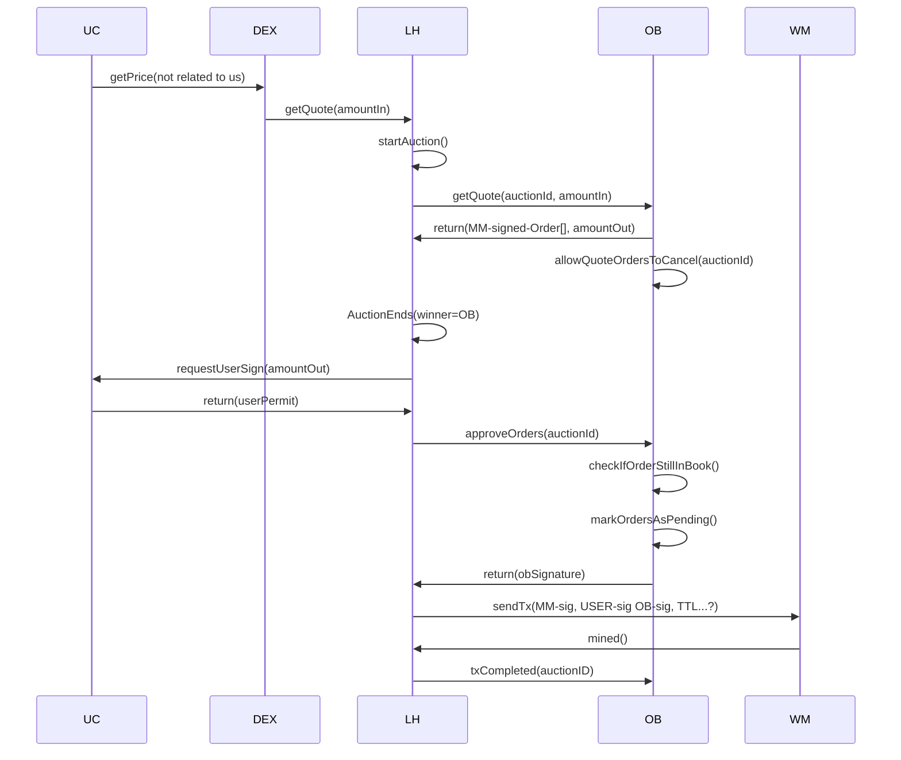

## Pending Orders Sequence Diagram

## Endpoints (MVP)

### MM

1. addOrder(order) POST - create a new order
2. cancelOrder(orderId) DELETE - cancel an order
3. orders() GET (returns Order[] for a given MM) - get all orders for a given MM

### LH

1. getQuote(amountIn, tokenIn, tokenOut) GET - get a quote for a given amountIn of tokenIn for tokenOut
2. confirmSwap(orderId) POST - order can no longer be cancelled
