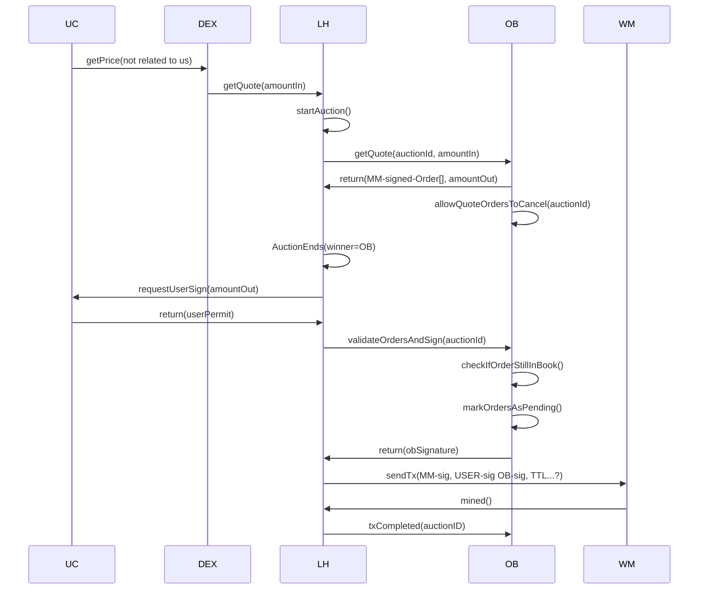

## Pending Orders Sequence Diagram

```mermaid
sequenceDiagram
UC ->> DEX: getPrice(not related to us)
DEX ->> LH: getQuote(amountIn)
LH ->> LH: startAuction()
LH ->> OB: getQuote(auctionId, amountIn)
OB ->> LH: return(MM-signed-Order[], amountOut)
OB ->> OB: allowQuoteOrdersToCancel(auctionId)
LH ->> LH: AuctionEnds(winner=OB)
LH ->> UC: requestUserSign(amountOut)
UC ->> LH: return(userPermit)
LH ->> OB: validateOrdersAndSign(auctionId)
OB ->> OB: checkIfOrderStillInBook()
OB ->> OB: markOrdersAsPending()
OB ->> LH: return(obSignature)
LH ->> WM: sendTx(MM-sig, USER-sig OB-sig, TTL...?)
WM ->> LH: mined()
LH ->> OB: txCompleted(auctionID)
```